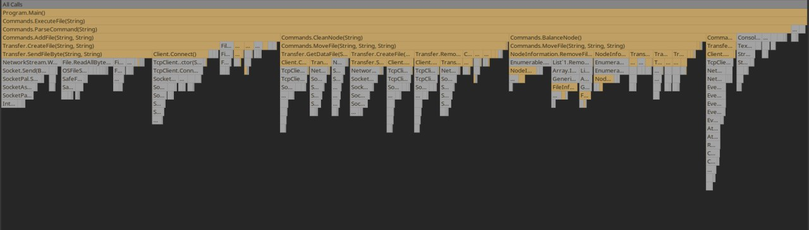

# Лабораторная работа №4

Была сделана распределённая файловая система.

Дальше были произведены тесты:

100 файлов

Распредения времени исполнения каждого метода:

 

Потребляемая память: 

1000 файлов

Распредения времени исполнения каждого метода:

Потребляемая память: 

10000 файлов

Распредения времени исполнения каждого метода:

Потребляемая память: 

Были проведены изменения:

1. Была переделана передача файла, и вместо использование массива байтов переведено на ArrayPool<byte>

100 файлов

Распредения времени исполнения каждого метода:

 

1000 файлов

Распредения времени исполнения каждого метода:

Потребляемая память: 

10000 файлов

Распредения времени исполнения каждого метода:

Потребляемая память: 

Дальше были все классы-сущности изменены на record, что так же дало небольшое уменьшение памяти.

Потребляемая память при 10000 файлах

